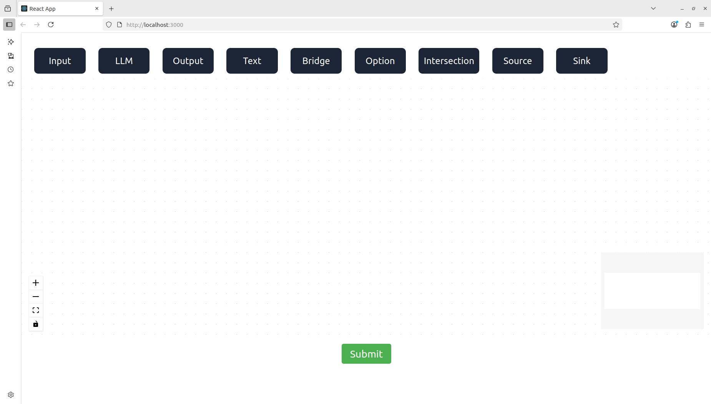
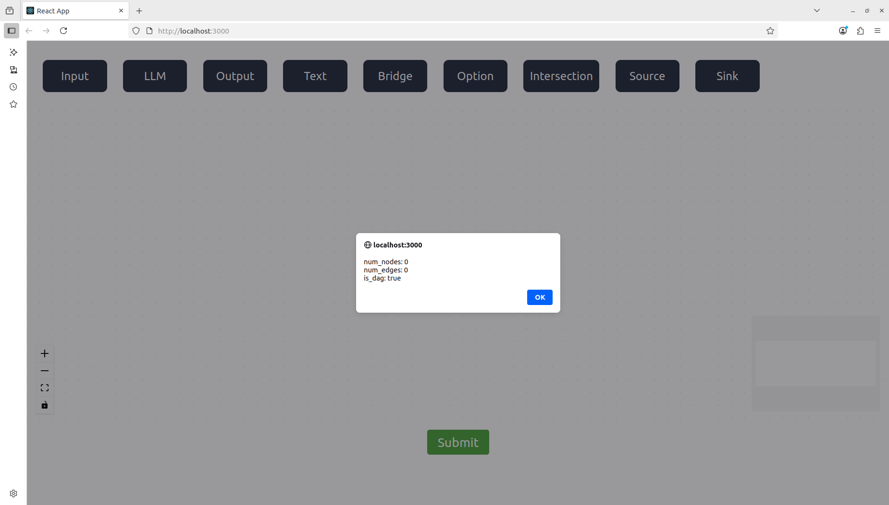
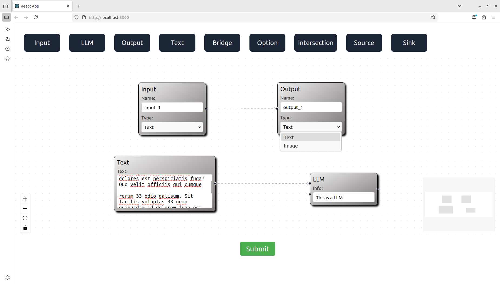
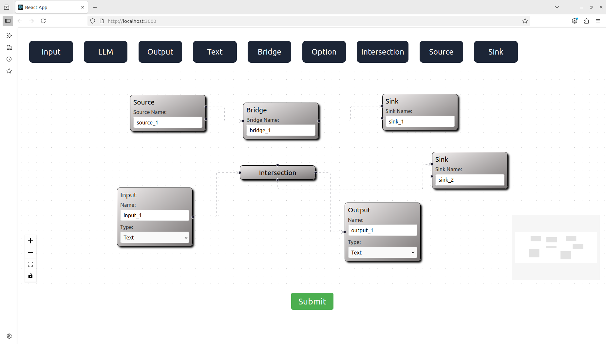
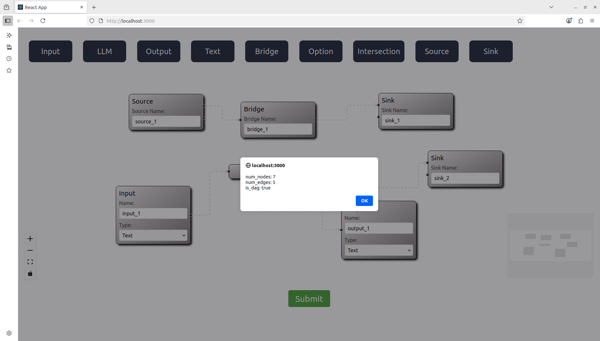
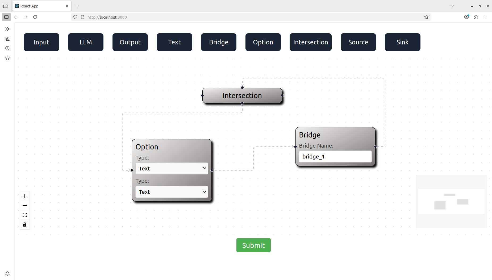
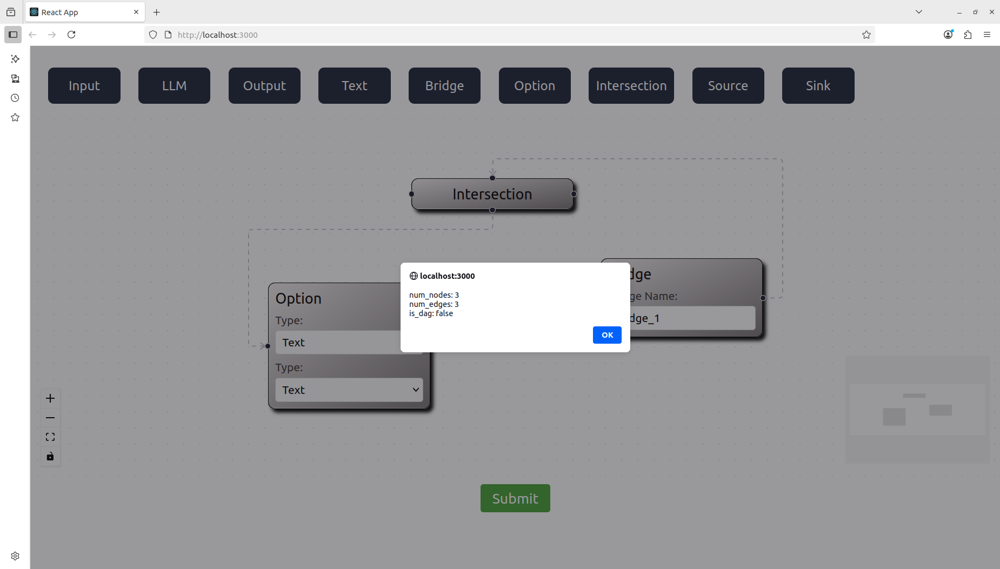

## Description

--> Designed a web application for creating, editing and analyzing interactive flow diagrams.

--> The project is divided into two parts: frontend and backend.

--> The frontend is developed using React, React Flow, JavaScript, HTML and CSS.

--> The backend is developed using Python.

--> A user can add different types of nodes and make a flow diagram using the frontend.

--> The nodes have handles on the left, right, top and/or bottom sides which can be connected to form the edges between the different nodes or within the same node.

--> Upon clicking the submit button, the flow diagram data is sent to the backend Python code via a http POST request.

--> The backend Python code counts the number of nodes and edges, determines whether the created flow diagram is a DAG (Directed Acyclic Graph) or not and sends the response back to the frontend, which is then displayed to the user via an alert message.

## Getting Started
### 1. Clone the Repository
```bash
git clone git@github.com:shubhrajit-santra/vectorshift_reactflow_app.git
```
### 2. Start the Frontend:
```bash
cd vectorshift_reactflow_app/frontend
npm i
npm start
```
### 3. Start the Backend (in a separate terminal):
```bash
cd vectorshift_reactflow_app/backend
uvicorn main:app --reload
```

## UI Snapshots
## Snapshot1

## Snapshot2

## Snapshot3

## Snapshot4

## Snapshot5

## Snapshot6

## Snapshot7

